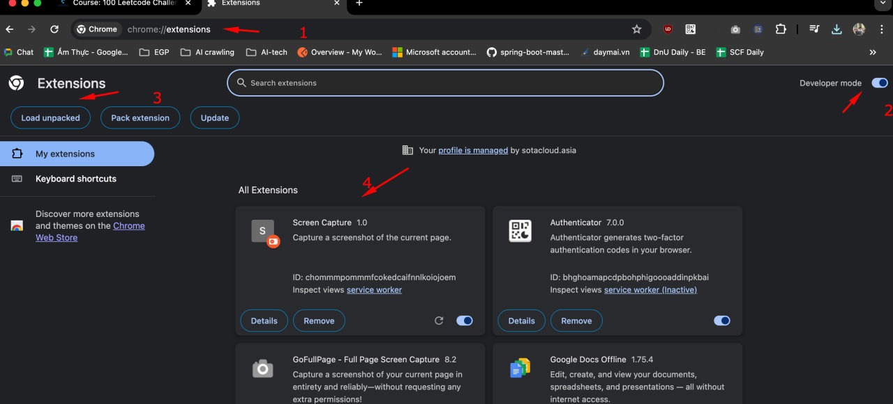
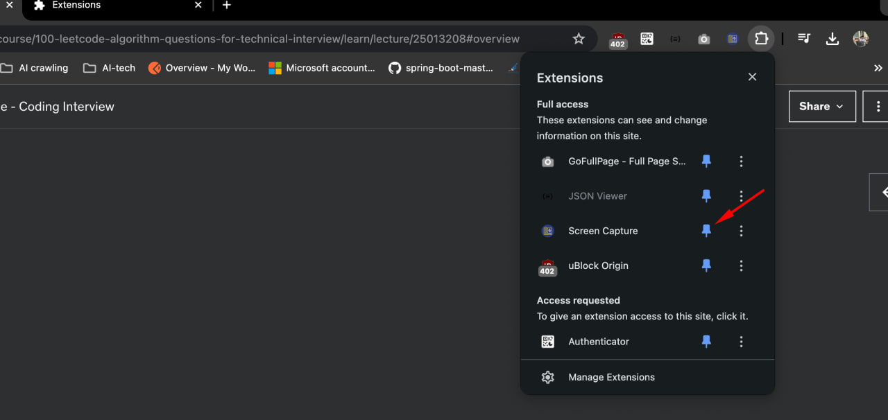
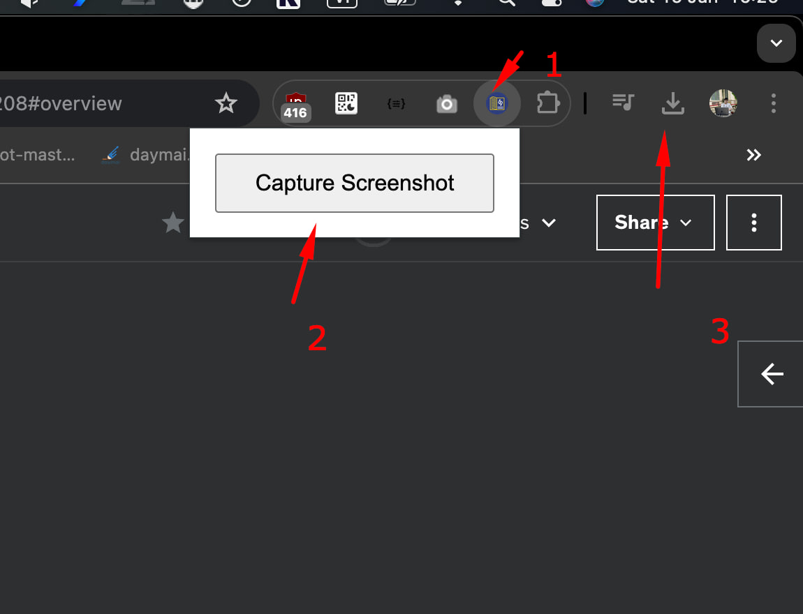
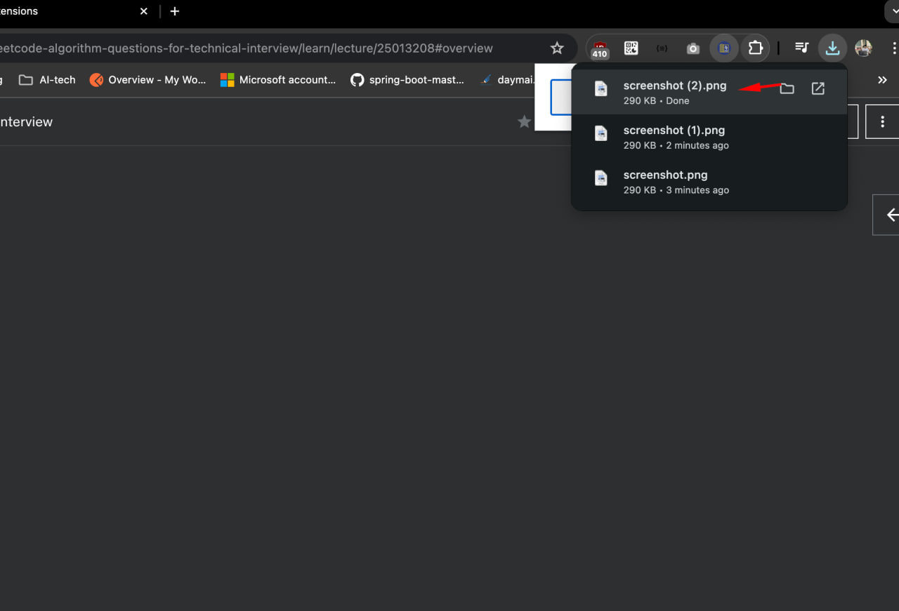

# Chrome-extension-capture-on-web
## Chrome extension to capture screenshots on web

## User Guide
### Step 1: Download the source code and upload the extension to Chrome

### Step 2: Pin the extension

### Step 3: Navigate to the webpage you want to capture, then click on the extension and select capture

### Step 4: Go to the downloads folder to view your screenshot

